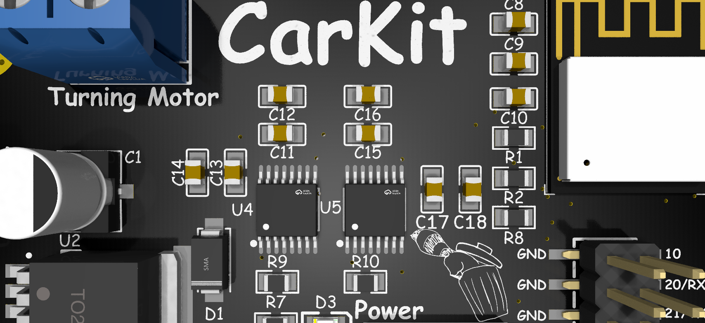

  

# CarKit – Because Your RC Car Needs a Brain  

### A Swiss-Army-Knife Control Board for DIY RC Chaos™  

*(You bring the chassis. It brings the brains.)*  

---

## Renders
*Visuals because everyone loves eye candy.*

---

## BOM
All the silicon, blinkenlights, and screw-down bits live **[here](/BOM.csv)**.

**Main characters:**
- **MCU:** ESP32-C3-WROOM-02
- **Motor Driver:** DRV8876 dual DC motor driver
- **5 V Regulator:** LM2596SX-5.0 buck converter
- **3.3 V Regulator:** AMS1117-3.3 LDO
- **RGB LEDs:** SK6812 addressable LEDs (x4)
- **Power LED:** XL-2012UVA
- **Inputs:** USB-C, Barrel jack, and screw terminal power
- **Connectors:** KF301 5.0 mm terminal blocks + 2×3 SMT headers  
- **Misc:** Buttons, buzzer, pull-ups, decoupling caps, and the usual supporting cast  

(See `BOM.md` for the full part list, values, and LCSC links.)

---

## What is this?

This is a **do-it-all RC control board** built around an **ESP32-C3**, designed to handle basically everything you might want on a DIY RC car:

- **2 DC motors with PWM** (think: **drive** + **steering/turning**)
- **1 BLDC motor output** (via external ESC)
- **1 servo motor output**
- **Bluetooth gamepad support** (so you can use almost any Bluetooth controller)
- **Multiple power input options** (USB-C, barrel jack, or raw battery via screw terminals)
- **4 RGB status LEDs** for connection, mode, and “because RGB”  
- **On-board buzzer** for beeps, alerts, and dramatic startup tones

It’s meant to be the **drop-in brain** for “I duct-taped this together but now I want it to drive nicely” RC builds.

---

## Features

### Motor Control
- **2× DC motor channels**
  - PWM control for speed
  - Direction control via DRV8876
  - Great for **drive + steering** or **tank drive*** setups
- **1× BLDC channel (signal)**
  - Standard PWM output to an external ESC
- **1× Servo output**
  - For steering, camera gimbals, or cursed animatronics
 
*While the board supports tank drive it wasn't built for it.

### Power Options
Because every DIY RC build uses a *different* battery, obviously.

- **USB-C (5 V)**
  - For bench testing, firmware dev, and flexing modern ports
- **Barrel jack**
  - Perfect for **9 V batteries** or standard DC wall adapters
- **Screw terminals**
  - Bring your own LiPo / battery pack
- **On-board power handling:**
  - **LM2596SX-5.0** buck converts input to 5 V
  - **AMS1117-3.3** steps 5 V down to 3.3 V for the ESP32-C3
  - Bulk and decoupling caps sprinkled everywhere to keep noise and brownouts away
  
*(Dont feed the board anything over 36V, I would recommend staying under 24V)*

### LEDs & Buttons
- **4× SK6812 RGB LEDs**
  - Can show:
    - **Connection status** (paired / searching / sad)
    - **Board mode** (e.g. normal, config, debug)
    - **User-defined patterns** (rainbow, brake lights, underglow, whatever)
- **1× Power LED**
  - Because sometimes you just need “is this thing on?”
- **Tactile buttons**
  - For reset and boot functions (programming)

### Connectivity & IO
- **ESP32-C3 MCU**
  - **Wi-Fi + Bluetooth LE**
  - Extra GPIOs broken out via **2×3 SMT headers** for expansion
- **Screw terminal outputs**
  - For motors, power, and other “don’t-come-loose” connections

---

## Motor Channels Overview  

| Channel     | Type        | Typical Use              | Notes                                   |
|-------------|-------------|--------------------------|-----------------------------------------|
| M1          | DC Motor    | Main Drive               | PWM + DIR via DRV8876                   |
| M2          | DC Motor    | Turning / Steering       | PWM + DIR via DRV8876                   |
| BLDC OUT    | PWM Signal  | Brushless ESC Input      | External ESC drives the BLDC motor      |
| SERVO OUT   | Servo PWM   | Steering / Gimbal / Etc. | Standard RC-style servo signal          |

---

## How It Works

At a high level:

1. **You power the board** via USB-C, barrel jack, or screw terminals.  
2. The **LM2596** generates a solid 5 V rail, and the **AMS1117** creates the 3.3 V rail for the ESP32-C3.  
3. The **ESP32-C3** runs your firmware:
   - Reads input from a **Bluetooth controller**
   - Outputs PWM and direction signals to the **DRV8876** for the DC motors  
   - Generates PWM for the **BLDC ESC** and **servo**  
   - Drives the **SK6812 RGB LEDs** and **buzzer** to show status and vibes  

All the “annoying parts” (power, drivers, IO protection, connectors, etc.) are on the PCB, so you can focus on mechanical design.

---

## Using a Bluetooth Controller

The exact firmware and controller mapping is up to you and some basic stuff is included, but the general idea is:

1. Flash your ESP32-C3 firmware that:
   - Pairs with a **Bluetooth gamepad / controller**
   - Maps sticks/triggers/buttons to motor speeds and steering
2. On startup, the **RGB LEDs** can:
   - Pulse / chase while waiting for a controller  
   - Turn solid once connected  
3. Drive your RC car like a normal RC car, but with way more flexibility and hackability.

*(You can map “A” to beep the buzzer. You absolutely should.)*

---

## RGB LEDs  

Because a control board without RGB is just morally wrong.

Possible roles for the **4 SK6812 LEDs**:

- **LED 1 – Connection status (Bluetooth)**  
- **LED 2 – Mode indicator (normal / config / debug)**  
- **LED 3-4 – User bling (animations, underglow, warnings, etc.)**

Or ignore all that and just run full rainbow vomit. No judgment.

---

## Why?  

This board exists for that moment when you’ve got:

- An RC chassis
- Some motors
- A pile of batteries
- And zero desire to reinvent **“basic motor control + power + Bluetooth”** *again*

It’s meant to be the **one board** that handles:
- Motors
- Power
- Input
- Feedback

…so you can just design something cool and let this handle the boring electronics.

---

## Contribute  

Have ideas? Want a new connector, mode, sample firmware, or just want to roast my layout?

- Open an **issue**
- Submit a **PR**
- Or just yell at me on GitHub with suggestions

---

## Disclaimer  

This project is open-source, powered by **vibes**, and tested mostly on my own questionable hardware.  

If you:
- Overvolt it  
- Reverse the battery  
- Strap it to a rocket  
- Or send 48 V into something that wanted 5 V  

…and it smokes, explodes, or develops sentience, that’s **entirely on you.**

Happy hacking!
